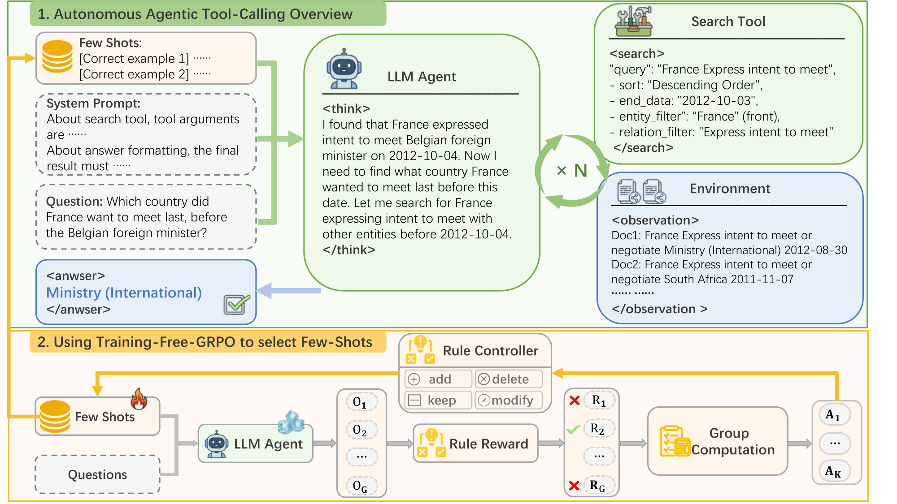
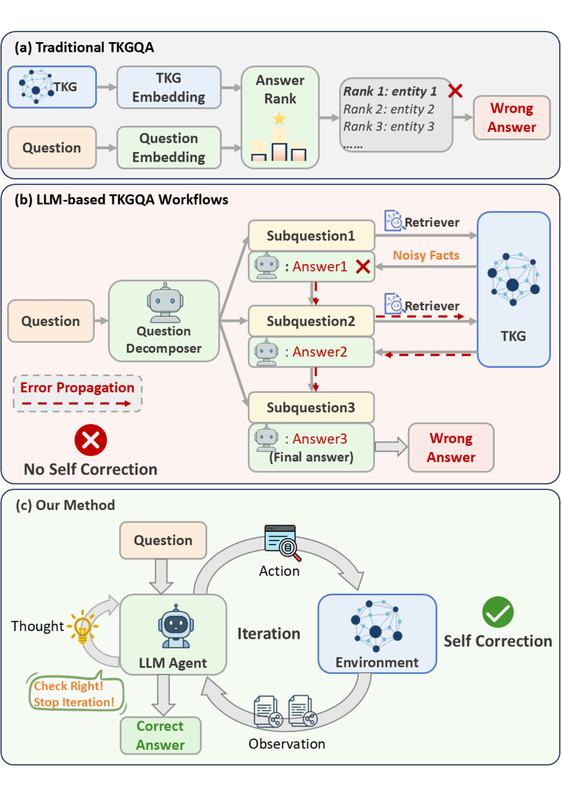

# AT2QA Official Code

This repository is the **official implementation** of **AT2QA (Autonomous, Training-free Agent for Temporal Question Answering)**.

AT2QA reaches **0.887 Hits@1** on MultiTQ test, improving over prior SOTA by **+10.7 percentage points** (from 0.780 to 0.887).  
Beyond performance, AT2QA is designed as a **paradigm-shifting framework** for Temporal KGQA: moving from rigid, static workflows to a fully **autonomous agent** that iteratively searches, verifies, and self-corrects.

For reproduction, you can directly run `eval/agent_eval.py` (default few-shot).  
You **do not need** to run `training-free-grpo` to reproduce the main evaluation numbers, because the bundled few-shot prompt already contains the selected experiences from training-free GRPO.

The end-to-end API cost for reproducing core evaluation is roughly **under USD $150** (depending on provider pricing and rerun settings).  
If you do not want to spend API cost, we also provide sampled full trajectories in `full_sampled_trajectories/`.

# MultiTQ Clean Release (for paper code upload)

This folder is a cleaned, self-contained package for:
- standard evaluation (`eval/agent_eval.py`, default **few-shot**)
- zero-shot pass@k experiment (`scripts/run_passk_zero_shot.py`)
- training-free GRPO-style few-shot selection (`training-free-grpo/`)
- sampled full trajectories for analysis (`full_sampled_trajectories/`)

## Folder layout

- `eval/agent_eval.py`
- `eval/prompts/system_with_fewshot.md` (**default prompt for eval**)
- `eval/prompts/system.md` (zero-shot prompt)
- `MultiTQ/kg/full.txt`
- `MultiTQ/questions/*.json` (all question files, including train/dev/test)
- `MultiTQ/embeddings/full_norm256_conc/`
  - `embedding-3.f32.npy`
  - `embedding-3.meta.jsonl`
  - `stats.json`
- `full_sampled_trajectories/` (renamed from `AT2QA_full_traces`, 273 files)
- `assets/method_overview.png`
- `assets/comparison_methods.png`
- `scripts/run_passk_zero_shot.py`
- `scripts/plot_passk.py`
- `training-free-grpo/run_training_free_grpo.py`
- `training-free-grpo/experience_bank.json`
- `requirements.txt`
- `.env.example`

## Environment

1. Use Python 3.10+ (or your existing `Multi-RAG` conda env).
2. Install dependencies:

```bash
pip install -r requirements.txt
```

3. Create `.env` from `.env.example` and fill keys:

```bash
DEEPSEEK_API_KEY=...
ZHIPU_API_KEY=...
```

`eval/agent_eval.py` reads env vars from `.env` in current working directory.

## Standard eval (few-shot by default)

`eval/agent_eval.py` now defaults to:
- prompt: `eval/prompts/system_with_fewshot.md`

Example:

```bash
python eval/agent_eval.py \
  --base-url https://api.deepseek.com \
  --chat-model deepseek-chat \
  --num 200 \
  --questions-file MultiTQ/questions/test.json \
  --out-name eval_fewshot_test200
```

## Zero-shot pass@k experiment

The pass@k logic is:
- sample 3000 questions once from `MultiTQ/questions/test.json`
- round 1: run all sampled questions
- round i>1: rerun only questions not solved before
- pass@k = cumulative solved ratio after round k

Run from this folder root:

```bash
python scripts/run_passk_zero_shot.py \
  --base-url https://api.deepseek.com \
  --chat-model deepseek-chat \
  --sample-n 3000 \
  --k 10 \
  --chunk-size 200 \
  --concurrency 20 \
  --prompt-path eval/prompts/system.md \
  --agent-script eval/agent_eval.py \
  --out-dir MultiTQ/eval_runs \
  --prefix passk_zero_shot_clean \
  --resume
```

Outputs:
- sample file: `MultiTQ/eval_runs/passk_zero_shot_clean_sample3000.json`
- per-round chunk results: `MultiTQ/eval_runs/passk_zero_shot_clean_roundXX_partYYY.json`
- summary: `MultiTQ/eval_runs/passk_zero_shot_clean_summary.json`

This release already includes a pre-sampled file:
- `MultiTQ/eval_runs/passk_zero_shot_clean_sample3000.json`

## Training-Free GRPO prompt selection

See:
- `training-free-grpo/README.md`
- `training-free-grpo/run_training_free_grpo.py`

Quick start:

```bash
python training-free-grpo/run_training_free_grpo.py \
  --base-url https://api.deepseek.com \
  --chat-model deepseek-chat \
  --n 32 \
  --g 4 \
  --k 8 \
  --val-sample 300
```

## Plot pass@k curve (optional)

```bash
python scripts/plot_passk.py \
  --summary MultiTQ/eval_runs/passk_zero_shot_clean_summary.json \
  --out-png MultiTQ/eval_runs/passk_zero_shot_clean_k10.png
```

## Paper Figures

### Method Overview (AT2QA)



Figure 4: The overview of our proposed framework AT2QA. Top: At inference, an LLM agent repeatedly queries a Search Tool to interact with the TKG environment until sufficient evidence is collected. Inputs include a system prompt, the question, and few-shot demonstrations. Bottom: The few-shot library is selected from candidate trajectories via training-free GRPO-style rule editing with rule-based rewards.

### Comparison with Existing Methods



Comparison between **AT2QA** and existing methods. **(a) Traditional Embedding Methods** rely on static vector representations, lacking semantic understanding. **(b) Static LLM Workflows** decompose questions through rigid, predefined pipelines; an initial retrieval failure inevitably cascades through the subsequent steps (Error Propagation) due to the absence of autonomy. **(c) AT2QA** empowers the LLM as a fully autonomous agent. Through iterative environment interaction, the agent can dynamically verify evidence and self-correct its reasoning trajectory, effectively overcoming the bottleneck of static workflows.

## Main Results (MultiTQ Test, Hits@1)

| Model | Overall | Question Type (multiple) | Question Type (single) | Answer Type (entity) | Answer Type (time) |
|---|---:|---:|---:|---:|---:|
| **TKG Embedding-based Methods** |  |  |  |  |  |
| EmbedKGQA | 0.206 | 0.134 | 0.235 | 0.290 | 0.001 |
| CronKGQA | 0.279 | 0.134 | 0.337 | 0.328 | 0.156 |
| MultiQA | 0.293 | 0.159 | 0.347 | 0.349 | 0.157 |
| **LLM-based Static Workflows** |  |  |  |  |  |
| Search-R1 | 0.352 | 0.094 | 0.474 | 0.230 | 0.705 |
| ARI | 0.380 | 0.210 | 0.680 | 0.394 | 0.344 |
| TempAgent | 0.702 | 0.316 | 0.857 | 0.624 | 0.870 |
| TimeR$^4$ | 0.728 | 0.335 | 0.887 | 0.639 | 0.945 |
| MemoTime | 0.730 | 0.459 | 0.829 | 0.677 | 0.846 |
| RTQA | 0.765 | 0.424 | 0.902 | 0.692 | 0.942 |
| PoK | 0.779 | 0.409 | 0.929 | 0.696 | 0.962 |
| Temp-R1 | 0.780 | 0.550 | 0.888 | 0.714 | **0.969** |
| **Ours (Autonomous Training-free Agent)** |  |  |  |  |  |
| **AT2QA** | **0.887** | **0.751** | **0.942** | **0.864** | 0.945 |

Best results are highlighted in bold. AT2QA establishes a new state-of-the-art by breaking free from static workflows.

## Notes

- `eval/agent_eval.py` retrieval backend is brute-force cosine search over `embedding-3.f32.npy`.
- Results are saved under `MultiTQ/eval_runs/`.
